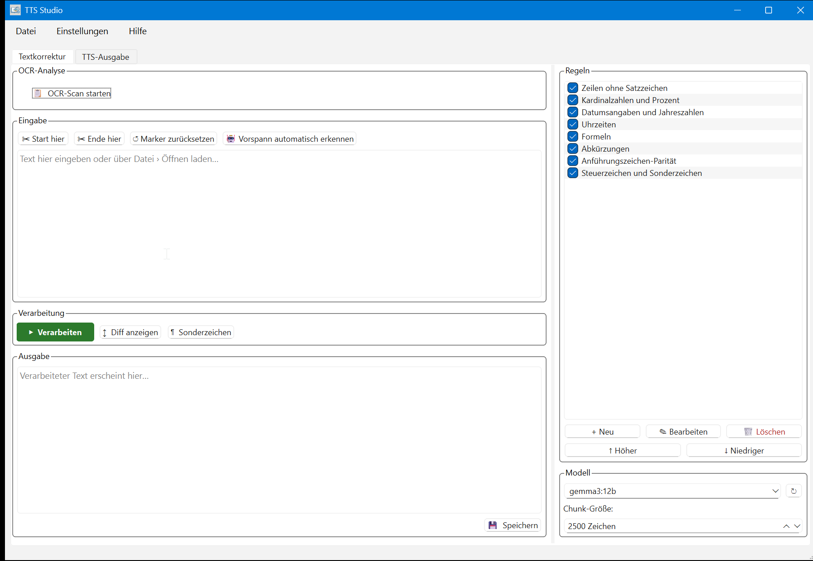

<p align="center">
  
</p>

# German Audiobook Pipeline

**Qwen3-TTS Audiobook Production + TTS Studio GUI**

Ein Open-Source-Projekt für automatisierte Hörbuchproduktion (EPUB/TXT → WAV/MP3/M4B) mit optionaler OCR- und textbasierter Vorverarbeitung (Ollama / LLM), konfigurierbarer Rechtschreib-/Grammatikregel-Engine und Docker-basiertem Qwen3-TTS.

## 📁 Projektstruktur

- `tts/` : Core-Audiobook-Pipeline mit Docker-Compose und Modell-Handling (`audiobook.py`, `test_tts.py`, `docker-compose.yml`, `Dockerfile`)
- `tts_studio/` : Desktop-Anwendung (PyQt6) für interaktiven Workflow
  - `core/` : Business-Logik (EPUB-Reader, OCR-Scanner, Ollama-Client, Prompt Builder, Regeln, Settings, TTS-Bridge, Voice Profiles)
  - `ui/` : GUI-Komponenten
  - `data/` : Default-Regeln, Settings, Voice Profiles
  - `tests/` : Pytest-Tests
- `README.md` : Diese Dokumentation

## ✨ Hauptfunktionen

### Audiobook-Pipeline (`tts/`)
- Qwen3-TTS (oder Transformers-Fallback) mit GPU-Beschleunigung
- Optionale SageAttention-Patch für SM120-fähiges fp8
- Voice prompt caching (safetensors) & ICL/X-Vector-Modus
- Segmentierung: Paragraphen oder Sätze
- Kontextfenster (CONTEXT_SENTENCES) für prosodische Kohärenz
- Autoregressiver Modus (Paragraph/Einzel-Satz)
- Zeit- und VRAM-Messung; Batch-Runtime-To-Audio-Ratio (RTF)
- Ausgabe: Kapitel-WAVs + zusammengeführter Buch-WAV

### TTS Studio GUI (`tts_studio/`)
- EPUB/TXT laden mit Textvorschau
- OCR-Scanner erkennt typische deutsche OCR-Fehler
- Regelbasierte Textkorrektur (Satzzeichen, Zahlen, Datumsformate, Abkürzungen, Anführungszeichen, Sonderzeichen)
- LLM-Vorverarbeitung (Ollama) via Chunking
- Steuerung von Modell, Chunk-Größe, Format-Ausgabe (MP3/WAV/M4B)
- Pause/Weiter/Abbrechen sowie Cache für unterbrochene Verarbeitung

### TtsBridge (Docker-Integration)
- Text → `input/*.txt` → Docker-Container `qwen-tts` → erzeugte WAVs
- Automatische ffmpeg-Konvertierung nach MP3/M4B

## �️ UI-Vorschau

Die folgenden Screenshots zeigen die wichtigsten Ansichten von TTS Studio:

<p align="center">
  
</p>

> Hinweis: Die Bilddateien sind nicht automatisch enthalten. Bitte in `tts_studio/screenshots/` ablegen und ggf. unter Versionskontrolle aufnehmen.

## �🛠️ Systemanforderungen

- Windows/Linux, x86_64 oder ähnliche
- NVIDIA GPU mit CUDA (SM 75+ empfohlen, ausgerichtet auf SM120)
- Docker + Docker Compose
- Python 3.11+ (für `tts_studio`)
- `ffmpeg` im PATH für MP3/M4B-Konvertierung
- `ollama` (optional für language model preprocessing)

## �️ Datenschutz & Urheberrecht (Privacy by Design)

Dieses Projekt verfolgt konsequent einen Local-First-Ansatz. Dies hat sowohl technische als auch rechtliche Gründe:

- Kein Cloud-Upload: E-Books unterliegen häufig strengen Urheberrechten. Durch die Nutzung von Ollama und lokalen Docker-Containern (Qwen3-TTS) verlassen keine geschützten Texte oder generierten Audiodaten das lokale System.

- Datensouveränität: Es werden keine Daten an Drittanbieter (wie OpenAI oder Anthropic) übermittelt. Dies verhindert "Data Leaks" und sorgt für 100%ige Konformität mit privaten oder betrieblichen Sicherheitsrichtlinien.

- Unabhängigkeit: Die Pipeline funktioniert vollständig offline. Es entstehen keine variablen API-Kosten pro Buchstabe oder Token.

## �🚀 Schnellstart

### 1) Clone

```bash
git clone https://github.com/<dein-repo>/german-audiobook-pipeline.git
cd german-audiobook-pipeline
```

### 2) Docker-Setup (ttt Pipeline)

1. .env oder `docker-compose.yml` anpassen:
   - `HF_TOKEN=...`
   - `REFERENCE_WAV=/voices/CB.wav`
   - optional: `REFERENCE_TEXT=/voices/CB.txt`

> Hinweis: `tts/voices/CB.wav`, `tts/voices/CB.txt` und `tts/voices/CB_prompt.safetensors` sind persönliche Referenzdateien.
> Diese Dateien dürfen nicht im Repository versioniert werden. Sie sind in `.gitignore` eingetragen.

2. Stimme vorbereiten:
   - `tts/voices/CB.wav` setzen (privat behalten)
   - optional: `tts/voices/CB.txt` (für ICL-Modus, privat behalten)
3. Input ablegen:
   - `tts/input/` => `book.epub` oder `book.txt`
4. Container starten (einmalig build + run):
   ```bash
   cd tts
   docker compose pull
   docker compose run --rm qwen-tts python audiobook.py /input/book.epub
   ```
5. Output in `tts/output` prüfen

### 3) TTS Studio GUI (optional)

1. Python-Abhängigkeiten installieren:
   ```bash
   cd tts_studio
   python -m pip install -r requirements.txt
   ```
2. App starten:
   ```bash
   python main.py
   ```
3. Einstellungen in GUI prüfen
   - `Ollama URL`, `Modell`, `Chunkgröße`
   - `compose_file` (standard: `F:\\german-audiobook-pipeline\\tts\\docker-compose.yml`)
   - Input/Output-Verzeichnisse

## ⚙️ Wichtige Umgebungsvariablen (audiobook.py)

- `MODEL_ID` (Standard: `Qwen/Qwen3-TTS-12Hz-1.7B-Base`)
- `MODEL_CACHE` (Standard: `/models`)
- `HF_TOKEN` (HuggingFace-Zugriff)
- `REFERENCE_WAV`, `REFERENCE_TEXT`
- `VOICE_PROMPT_CACHE`
- `X_VECTOR_ONLY` (0=ICL, 1=x-vector)
- `CONTEXT_SENTENCES`, `TOKEN_BUDGET`, `MAX_NEW_TOKENS_FACTOR`
- `SEGMENT_MODE` (`paragraph`|`sentence`)
- `PARAGRAPH_MAX_CHARS`, `CROSSFADE_MS`, `PARAGRAPH_MODE`
- `VOICE_DESIGN_INSTRUCT`, `VOICE_DESIGN_MODEL_ID`, `VOICE_DESIGN_CACHE`
- `USE_TORCH_COMPILE`

### TtsBridge-konfigurierbar (tts_studio)
- `compose_file` (Pfad zu docker-compose.yml)
- `input_dir` (Text input for Docker)
- `output_dir` (WAV/MP3/M4B output)

## 🧪 Tests

- `cd tts_studio`
- `pytest -q`

Enthält: `test_epub_reader.py`, `test_marker_logic.py`, `test_ocr_scanner.py`, `test_ollama_client.py`, `test_processing_worker.py`, `test_prompt_builder.py`, `test_rules_manager.py`, `test_settings_manager.py`, `test_tts_bridge.py`, `test_voice_profile_manager.py`

## 🔍 Troubleshooting

- Fehlermeldung `CUDA nicht gefunden`: Stelle sicher, dass GPU-Treiber + NVIDIA Container Toolkit installiert sind.
- `ffmpeg` nicht gefunden: s.o.
- `ollama serve` fehlgeschlagen: Stelle sicher, dass Ollama läuft und `settings.json` richtigen URL enthält.
- `docker compose run` schlägt fehl: Volume-Pfade prüfen, `HF_TOKEN` richtig setzen, ggf.  `docker compose down --rmi local && docker compose up --build`.

## 📌 Tipps

- Nutze `VOICE_DESIGN_INSTRUCT` für syntaktische Sprecherstile, um Voice-Cloning zu vermeiden.
- Bei großen Büchern: `CONTEXT_SENTENCES` reduzieren und `TOKEN_BUDGET` tunen, um VRAM-Limits zu vermeiden.
- Autoregressionsmodus (`PARAGRAPH_MODE=1`) für maximale prosodische Konsistenz.

## 🤝 Mitmachen

- Issues öffnen auf GitHub
- Bugfixes und Feature-Requests per Pull-Request
- Tests ergänzen für neue Regeln oder textverarbeitbare Abläufe

## 📜 Lizenz

Dieses Projekt wird unter der MIT-Lizenz veröffentlicht. Siehe Datei `LICENSE`.

- Copyright (c) 2026
- Lizenz: MIT
